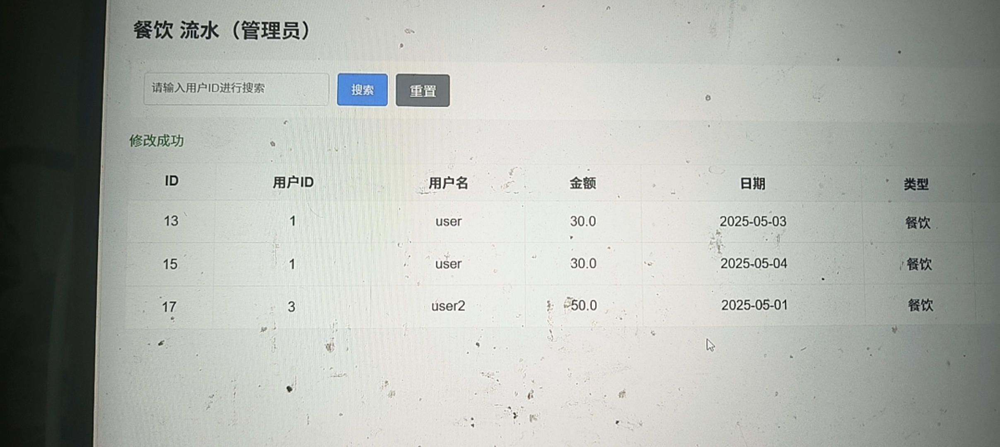
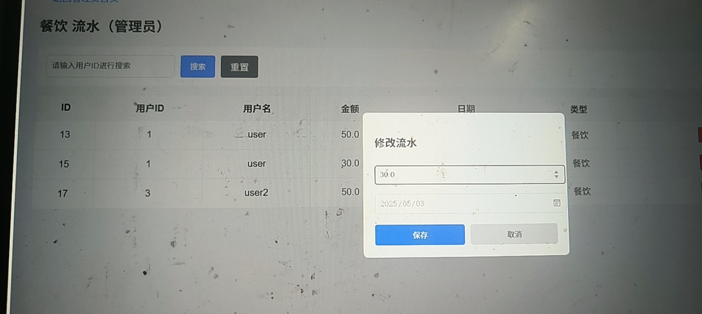
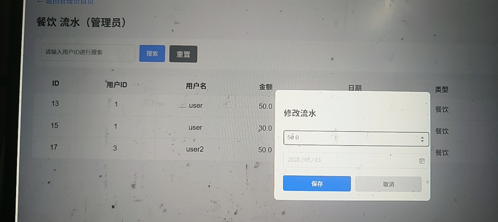

# -
本系统通过管理记录近期资金进出，算清盈亏，实时追踪流水，能够有效规避风险，提高资金安全和防范意识
# 资金管理系统 - 管理端流水修改测试

## 测试场景
验证管理员对用户流水记录的修改功能，包括金额编辑、数据同步和预算更新。

### 1. 修改弹窗：编辑流水信息

- 触发方式：在流水列表页点击「修改」按钮，弹出编辑窗口
- 初始数据：显示原流水记录的金额（30.0元）和日期（2025/05/03）
- 界面：包含金额输入框、日期选择器、保存/取消按钮

### 2. 输入修改内容

- 操作：将金额从30.0元修改为50.0元，日期保持不变
- 验证：输入框内数据与预期修改内容一致，无格式错误

### 3. 修改完成：数据同步更新

- 结果验证：保存后，列表中ID为13的流水金额成功更新为50.0元
- 状态提示：页面显示「修改成功」，数据与输入内容完全一致
- 额外校验：用户剩余预算同步更新，符合业务逻辑

---

### 测试结论
管理端流水修改功能运行正常，数据修改后实时同步，无异常报错，满足业务需求。
